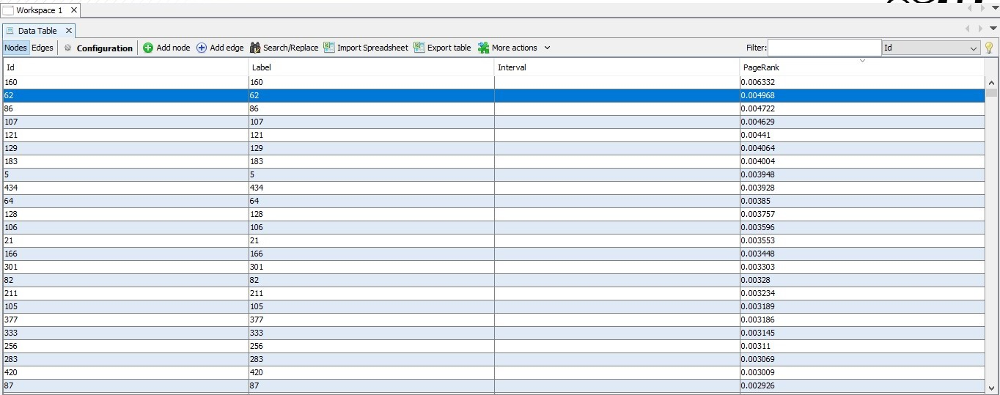

# GooglePageRank
Aims on removing the anomalies in the basic page rank algorithm.

### Dataset Description
* I have chosen the email-EU-core network dataset and the link for the dataset is [here](https://snap.stanford.edu/data/email-Eu-core.html).

### Algorithm Overview
The basic page rank algorithm suffered mainly two problems: 
*	Nodes with no outgoing edges – In that case the column corresponding to that node has all the entries as 0 and thus as the iterations increases the page rank tends towards 0.
*	When there are disconnected components in the graph.

These were the major problem as the dataset had the real-life scenarios of having these issues and hence random surfer model was adopted.

Random Surfer Model, A solution by Page and Brin –
In order to overcome these problems, fixed a positive constant p between 0 and 1, which is called the damping factor (a typical value for p is 0.15). 

### Results

The page rank results achieved by the implemented code and that from the Gephi showed similar trend but however there was a bit deviation in the page ranks of some nodes. Reason behind this was that the page rank achieved from the Gephi does not add up to 1, which mean the M matrix does not turns out to be column stochastic. But in my implementation, it all sums up to 1. 
The Code Output screenshot and that obtained from the Gephi is shown below. Since the output contains the page rank of 1005 nodes and it cannot be consolidated in a single screenshot only the few top nodes sorted in highest page rank along with their page rank is shown in Fig 1.
The Output of the Page rank generated from the Gephi tool is also attached in here with the same strategy. Only the few pages with top page ranks is shown here in the Fig 2.
For more detail two csv file has also been included which contains the output of the page ranks of all 1005 nodes generated from the code named as “CodeOutput.csv” and the one generated from the Gephi tool named as “PageRank.csv”.
By comparing Fig 1. And Fig 2., one can easily see that there is similar trend in the page rank results generated from the code and the Gephi tool with approximately same value of the page rank probability. The only mismatch for few nodes happens because of the reason discussed above. Reason – The page rank probabilities generated from the Gephi does not add to 1, while my implementation satisfies this property.

